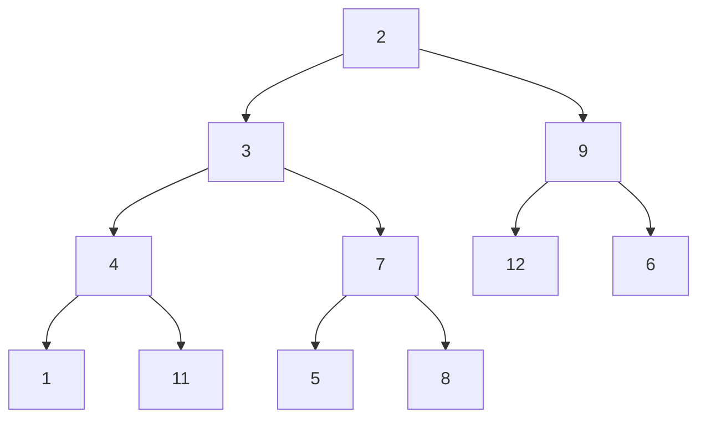

# Albert-World
My first repository on GitHub.

I love coding.

## Try to design file reference relationships

```mermaid
graph TB
    2-->3;
    2-->9;
    3-->4;
    3-->7;
    9-->12;
    9-->6;
    4-->1;
    4-->11;
    7-->5;
    7-->8;
```
